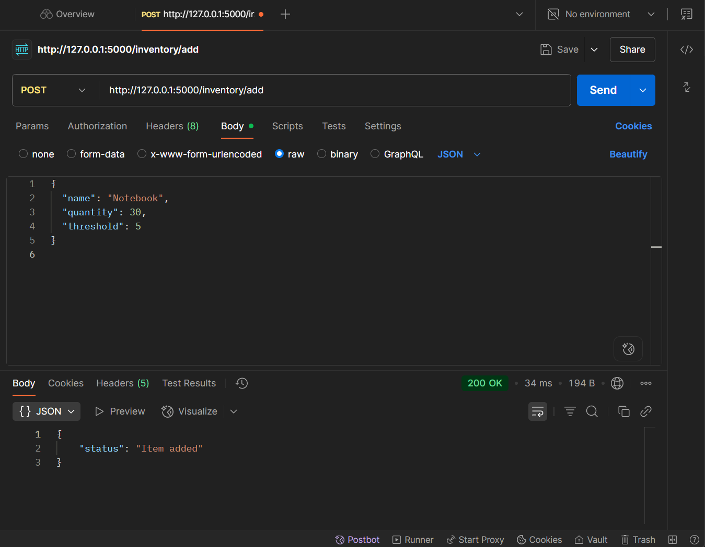
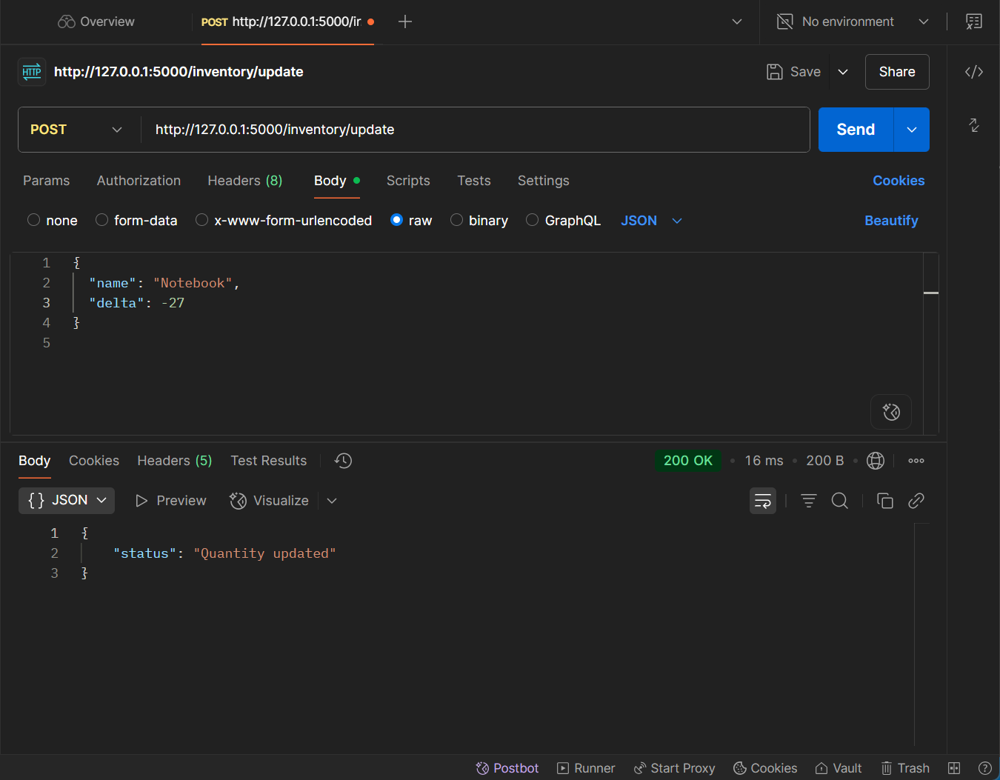
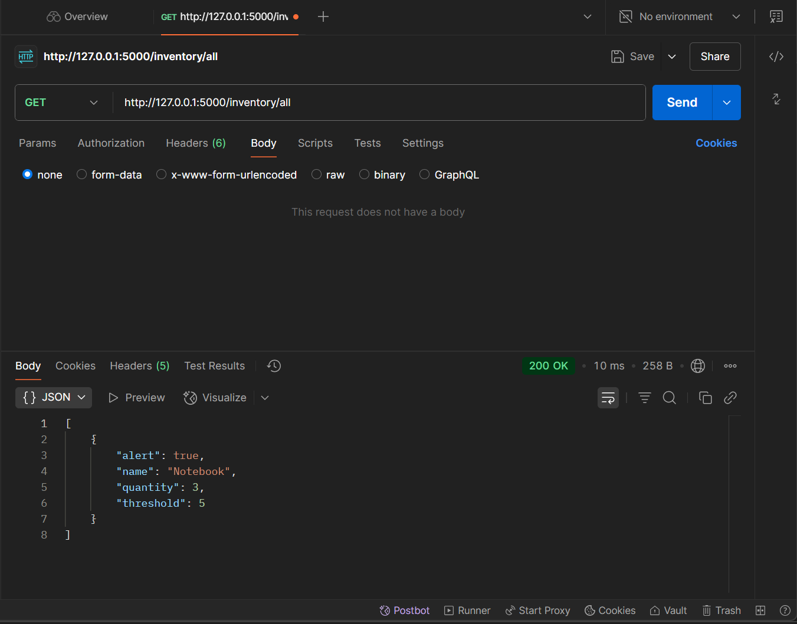

# 🧾 Flask Inventory API

A simple Flask-based inventory tracking API to:

- Add items
- Update quantities
- Trigger alerts when quantity falls below a threshold

---

## 🔗 API Endpoints

### ➕ Add Item
**POST** `/inventory/add`  
**Body:**
```json
{
  "name": "Notebook",
  "quantity": 30,
  "threshold": 5
}
```


---

### 🔁 Update Quantity
**POST** `/inventory/update`  
**Body:**
```json
{
  "name": "Notebook",
  "delta": -27
}
```



---

### 📦 Get All Items
**GET** `/inventory/all`  
**Response:**
```json
[
  {
    "alert": true
    "name": "Notebook",
    "quantity": 3,
    "threshold": 5,
    
  }
]
```


## ✍️ Author
Harshitha Chowdappa
